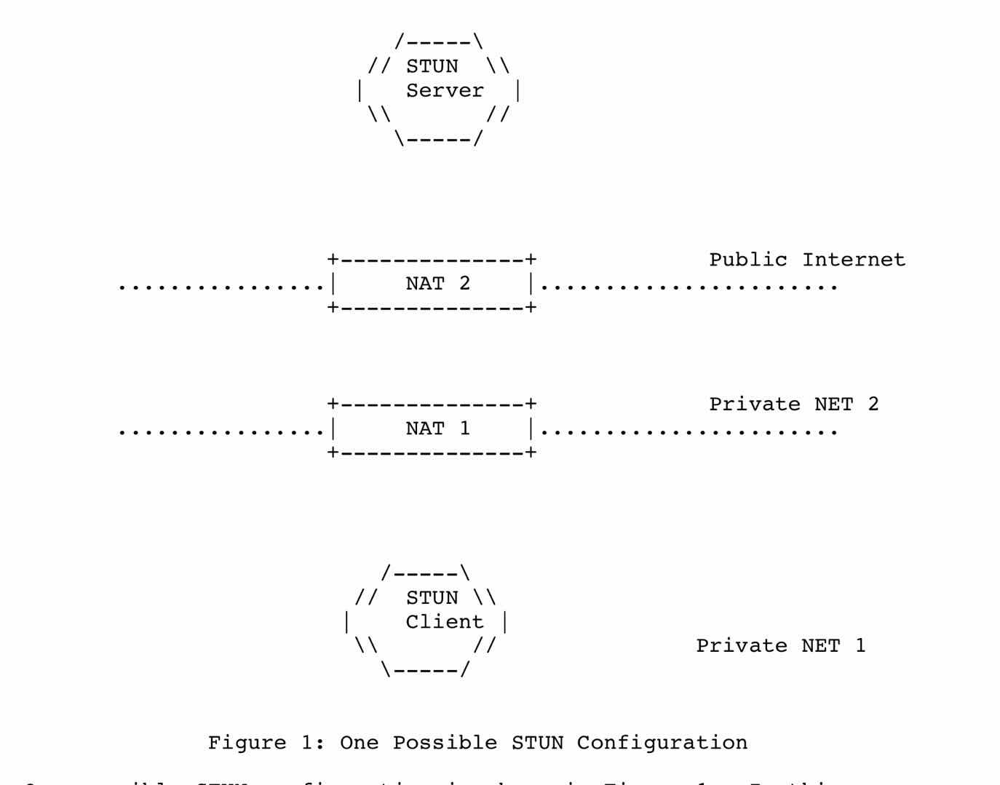

# STUN的运转概览

## 图1是一个STUN的构造图。在这个网络中有两个STUN设备，下方的是STUN客户端，在私网1里，私网1与私网2通过NAT1连接。私网2通过NAT2和公网相连，上方的是在公网中的STUN服务器。

## STUN是一个客户端-服务端协议，它支持两种食物。一个是请求/回复事务，也就是客户端给服务器发送请求，服务端收到后发送回复。另外一个是指示事务，也就是说任意一个STUN设备，不论是服务器还是客户端，给对方发送一个指示，指示不会受到回复。每种类型的事务都有一个事务ID，是一个随机选择的96的数字。在请求/回复事务中，事务ID可以让客户端将相对应的回复与请求关联；在指示事务中，事务ID用于协助调试。

## 所有的STUN消息都是从一个固定的头部开始的，这个头部包含一个方法，一个类别和一个事务ID。方法标明了这条消息是哪种请求，本文档中只指定了一个方法：绑定，其他的文档中有可能会定义其他方法；类别指明是消息是请求，成功回复，错误回复或者是指示。在固定头部后面是零个或者多个属性，属性是TLV编码的，通过属性STUN消息携带了额外的信息。

## 本文档定义了一个简单的方法：绑定，两种事务中都可以使用绑定。在请求/回复事务中，绑定方法可以用来指定一个NAT分配绑定给一个STUN客户端。绑定方法在两种事务中都可以用来维持绑定的心跳。

## 在绑定请求/回复事务中，STUN客户端给STUN服务器发送绑定请求。服务器收到绑定请求时，它可能已经经过了客户端与服务器之间的多个NAT（例如图1中经过了两个NAT）。当绑定请求通过一个NAT时，NAT会修改封包的源传输地址，因此在服务器看到的源传输地址是由最靠近服务器的NAT创造的，称之为反射的传输地址。STUN服务器复制反射的源传输地址到回复消息的异或映射地址（XOR-MAPPED-ADDRES）属性中，并发送回复消息给客户端。当回复的封包经过NAT的时候，NAT会修改IP头部的目的地的传输地址，但是STUN回复消息体异或映射地址中的地址不会改变。通过这种方法，客户端可以学习到自己最接近服务的NAT的反射的传输地址。

## 在有些用法里，SUN必须和其他的协议一起使用（例如ICE, SIP），因此在这些用法里必须能够区分一个封包是否是STUN消息。STUN消息头里有3个固定的字段用于与其他协议的区分。如果这样还不奏效，也可以在STUN封包中添加指纹值来更进一步地区分封包。

## STUN也定义了一个可选地机制，包含DSN查找，向轮换服务器的重定向，用于区分其他协议的指纹属性，两种校验方法，消息完整性校验。鉴权机制围绕着用户名，密码，消息完整性做文章。两种鉴权机制，也就是长期鉴权和短期鉴权，在第十章中介绍。

## 在长期认证机制中，服务器和客户端共享一个预先规定供给的账号密码，账号密码的交换认证使用了一个类似于HTTP[RFC2617]但细节上有所不同的挑战/回应机制。在短期认证机制中，客户端和服务端在STUN消息之前使用带外数据来完成账号密码的交换认证。例如ICE中使用了带外信令数据来完成服务器客户端账号密码的交换认证。这些安全机制都是用于完整性保护和请求回复消息的鉴权。